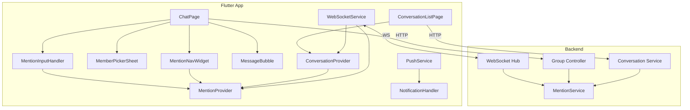
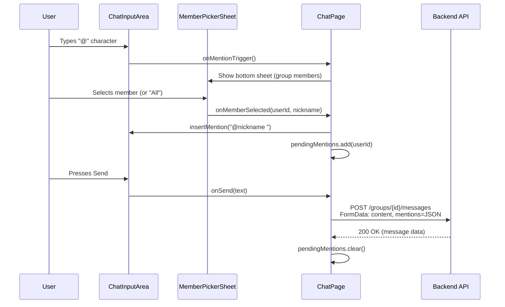
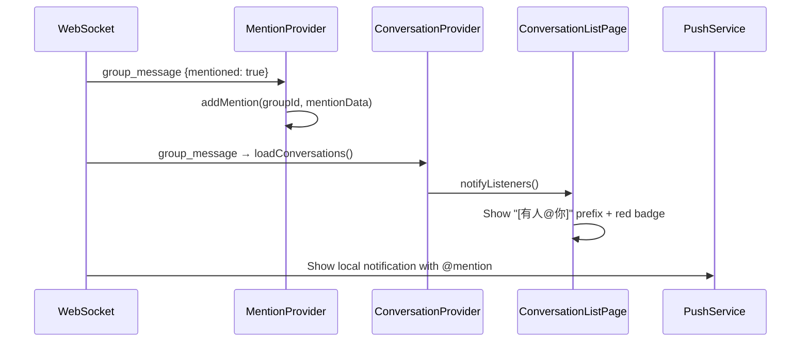
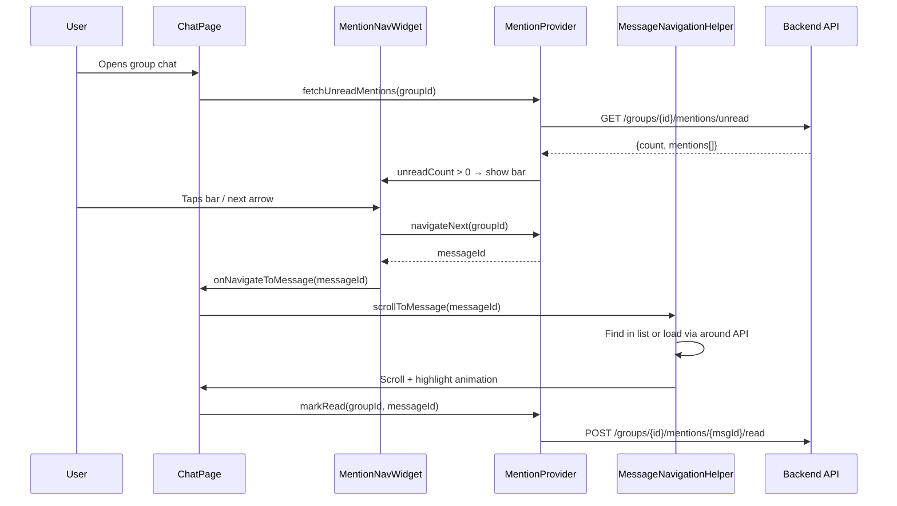
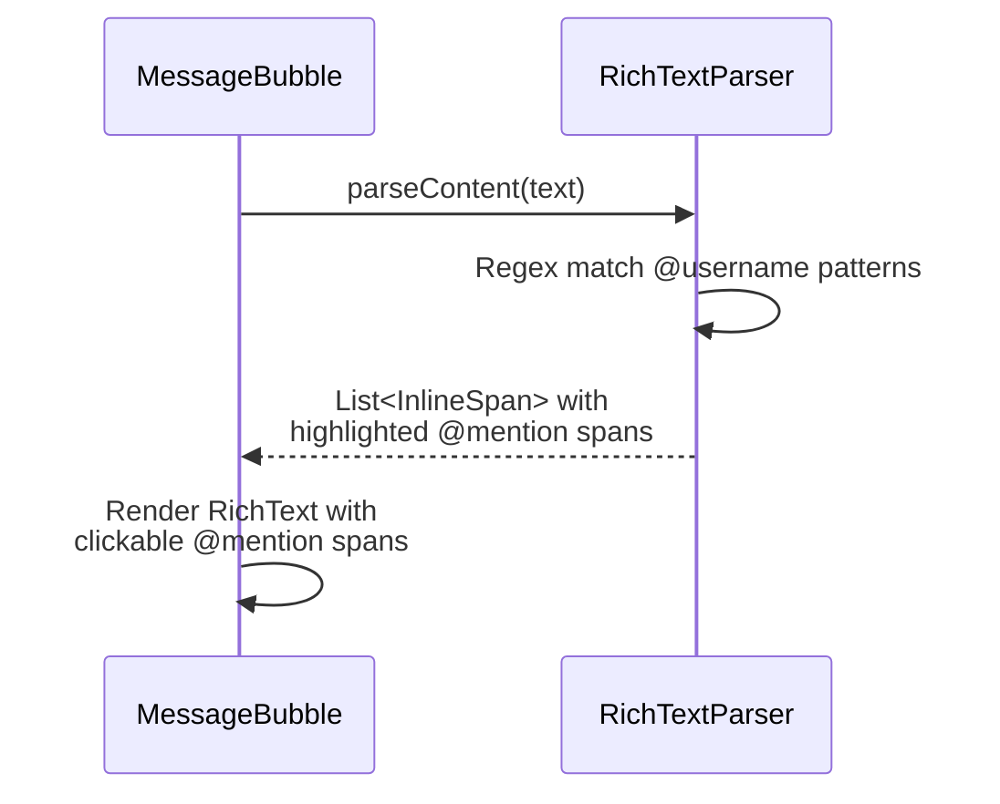

# Design Document: Flutter Group @Mention Feature

## Overview

This feature implements the complete @mention system for the Flutter mobile app, mirroring the existing Vue web frontend functionality. The system covers four core flows: sending @mentions (input trigger → member picker → construct mentions JSON → send with message), receiving @mentions (WebSocket `mentioned: true` → update conversation badge → show "[有人@你]" prefix → push notification), reading @mentions (open group chat → clear mention unread → navigation bar to jump between @messages), and rendering @mentions (display @username in message bubbles with highlight style).

The backend already fully supports @mentions via `MentionService` (Redis + MySQL), the conversations API returns `mention_unread_count`, and WebSocket broadcasts include `mentioned: true` for targeted users. The Flutter app already has a `MentionProvider` and `MentionNavWidget` skeleton — this design completes the integration across all layers.

## Architecture



## Sequence Diagrams

### Flow 1: Sending @Mentions



### Flow 2: Receiving @Mentions



### Flow 3: Reading @Mentions (Navigation)



### Flow 4: Rendering @Mentions in Bubbles



## Components and Interfaces

### Component 1: MentionInputController (New Helper Class)

**Purpose**: Detects "@" input trigger, manages `pendingMentions` list, and constructs the mentions JSON for message sending. Uses the same Controller/Helper pattern as `MessageNavigationHelper` — instantiated in ChatPage, not a mixin.

**Rationale**: ChatPage is already 2500+ lines. A mixin would further bloat it. An independent controller class keeps concerns separated and follows the existing `MessageNavigationHelper` pattern in this codebase.

**Interface**:
```dart
class MentionInputController {
  final List<dynamic> pendingMentions = [];

  /// Check if the latest text change is an "@" trigger at a valid word boundary.
  /// Returns true if member picker should be shown.
  bool checkMentionTrigger(String text, int cursorPosition);

  /// Insert "@nickname " at cursor after member selection.
  /// Also adds userId to pendingMentions.
  void insertMention(dynamic userId, String nickname, TextEditingController controller);

  /// Build mentions JSON string for API submission.
  /// Returns null if pendingMentions is empty.
  String? buildMentionsJson();

  /// Clear pending mentions after message sent.
  void clearPendingMentions();

  /// Dispose resources.
  void dispose();
}
```

**Responsibilities**:
- Detect "@" character typed at word boundary (start of line, after space/newline)
- Return a boolean so ChatPage can decide to show the member picker
- Track selected user IDs in `pendingMentions` (supports `"all"` and numeric user IDs)
- Serialize to JSON array format: `["all"]` or `[123, 456]` or `["all", 123]`
- Clear state after message is sent

**Integration point in ChatPage**:
- Instantiate in `_ChatPageState`: `final _mentionController = MentionInputController();`
- Hook into `_messageController.addListener(_onTextChanged)` in `initState`
- In `_onTextChanged`: call `_mentionController.checkMentionTrigger(text, cursorPos)` → if true, show picker
- In `_sendMessage`: inject `_mentionController.buildMentionsJson()` into FormData
- Dispose in `dispose()`

### Component 2: MemberPickerSheet (New Widget)

**Purpose**: Bottom sheet modal displaying group members for @mention selection, with search filtering.

**Interface**:
```dart
class MemberPickerSheet extends StatefulWidget {
  final int groupId;
  final int currentUserId;
  final bool isAdmin; // owner or admin can @all
  final void Function(dynamic userId, String nickname) onSelect;

  const MemberPickerSheet({
    super.key,
    required this.groupId,
    required this.currentUserId,
    required this.isAdmin,
    required this.onSelect,
  });
}
```

**Responsibilities**:
- Fetch group members via `GET /groups/{groupId}/members`
- Display searchable list with avatars, nicknames, and role badges
- Show "所有人" (All) option for admins/owners
- Filter out current user from the list
- Emit selected userId + nickname on tap

### Component 3: MentionProvider (Existing, Enhanced)

**Purpose**: Manages @mention unread state, navigation index, and WebSocket event handling.

**Interface** (already exists, key methods):
```dart
class MentionProvider extends ChangeNotifier {
  // State
  Map<int, List<Map<String, dynamic>>> _unreadMentions;
  Map<int, int> _unreadCounts;
  Map<int, int> _navigationIndex;

  // Getters
  int getUnreadCount(int groupId);
  List<Map<String, dynamic>> getUnreadMentions(int groupId);
  bool hasUnreadMentions(int groupId);

  // Actions
  Future<void> fetchUnreadMentions(int groupId);
  Future<void> markRead(int groupId, int messageId);
  Future<void> clearAll(int groupId);
  void addMention(int groupId, Map<String, dynamic> mentionData);
  void updateCounts(Map<int, int> countsMap);
  int? navigateNext(int groupId);
  int? navigatePrev(int groupId);
}
```

### Component 4: ConversationProvider (Existing, Minimal Changes)

**Purpose**: The badge/subtitle rendering logic lives in `_ConversationTile` widget (conversation_list_page.dart), not in the Provider. The Provider only needs to expose the `mention_unread_count` field that the backend already returns in the conversation list API.

**What the backend already provides**:
The conversation list API response already includes `mention_unread_count` per group conversation. No new Provider methods are needed for badge display — the UI layer reads it directly from the conversation map.

**Minimal changes needed in ConversationProvider**:
```dart
// In ConversationProvider:

/// Clear mention badge when entering a group chat.
/// Called from ChatPage._markAsRead() alongside existing unread clearing.
void clearMentionBadge(int groupId) {
  final index = _conversations.indexWhere((c) {
    final gId = c['target_id'] ?? c['group']?['id'];
    return c['type'] == 2 && gId == groupId;
  });
  if (index != -1) {
    _conversations[index] = {..._conversations[index], 'mention_unread_count': 0};
    notifyListeners();
  }
}
```

**Badge rendering changes (in _ConversationTile widget)**:
```dart
// In conversation_list_page.dart _ConversationTile.build():
final mentionCount = _toInt(conversation['mention_unread_count']) ?? 0;

// Subtitle: prepend "[有人@你]" when mentionCount > 0
// Badge: for muted groups with mentionCount > 0, show red badge instead of gray dot
```

**totalUnread enhancement** (optional, for tab bar badge):
```dart
int get totalUnread {
  int count = 0;
  for (final conv in _conversations) {
    if (conv['muted'] == true) {
      // Muted groups: only count @mentions toward badge
      if (conv['type'] == 2) {
        count += (conv['mention_unread_count'] as int?) ?? 0;
      }
    } else {
      count += (conv['unread_count'] as int?) ?? 0;
    }
  }
  return count;
}
```

### Component 5: MentionNavWidget (Existing, Complete)

**Purpose**: Navigation bar displayed above the input area showing "@mention count" with prev/next/close buttons.

Already implemented in `lib/widgets/mention_nav_widget.dart`. Integration needed in ChatPage.

**Integration point in ChatPage**:
```dart
// In ChatPage build(), above the input area:
// Requires MentionProvider to be registered in MultiProvider (see Dependencies section)
if (_isGroup && _groupId != null)
  Consumer<MentionProvider>(
    builder: (context, mentionProvider, _) {
      final count = mentionProvider.getUnreadCount(_groupId!);
      if (count <= 0) return const SizedBox.shrink();
      return MentionNavWidget(
        unreadCount: count,
        currentIndex: mentionProvider.getNavigationIndex(_groupId!),
        onNext: () => _navigateToNextMention(),
        onPrev: () => _navigateToPrevMention(),
        onClose: () => mentionProvider.clearAll(_groupId!),
      );
    },
  ),
```

### Component 6: MentionRichText (New Utility)

**Purpose**: Parses message content to identify @username patterns and renders them as highlighted, tappable spans.

**Interface**:
```dart
class MentionRichText {
  /// Parse message content and return a list of TextSpans
  /// @mentions are highlighted in primary color and tappable
  static List<InlineSpan> parse({
    required String content,
    required TextStyle baseStyle,
    TextStyle? mentionStyle,
    void Function(String username)? onMentionTap,
  });
}
```

**Integration point in ChatPage**:
The message bubble rendering logic (in `_buildMessageBubble` or equivalent method) currently displays message content as plain `Text`. For text messages in group chats, replace with:
```dart
// Instead of: Text(content, style: textStyle)
// Use:
RichText(
  text: TextSpan(
    children: MentionRichText.parse(
      content: content,
      baseStyle: textStyle,
      mentionStyle: textStyle.copyWith(color: AppColors.primary, fontWeight: FontWeight.w500),
    ),
  ),
)
```

**File location**: `lib/utils/mention_rich_text.dart`

## Data Models

### Mention Record (from backend API response)

```dart
/// Response from GET /groups/{id}/mentions/unread
class MentionItem {
  final int messageId;
  final int fromId;
  final String fromName;
  final String content;
  final String timestamp;

  MentionItem.fromJson(Map<String, dynamic> json)
    : messageId = json['message_id'] as int,
      fromId = json['from_id'] as int,
      fromName = json['from_name'] as String? ?? '',
      content = json['content'] as String? ?? '',
      timestamp = json['timestamp'] as String? ?? '';
}
```

### Conversation Model Enhancement

```dart
/// Fields already returned by backend in conversation list API:
/// - mention_unread_count: int (number of unread @mentions in this group)
/// - has_mention: bool (derived: mention_unread_count > 0)
///
/// The backend ConversationService already populates mention_unread_count
/// via BatchGetUnreadMentionCounts. No backend changes needed.
```

### WebSocket Group Message (with mention flag)

```dart
/// WS message structure when user is @mentioned:
/// {
///   "type": "group_message",
///   "id": 12345,
///   "group_id": 100,
///   "from": 42,
///   "from_name": "张三",
///   "content": "Hello @李四 check this",
///   "mentioned": true,           // ← key flag
///   "mention_unread_count": 3,   // optional, total unread count
///   "timestamp": "2024-01-01T00:00:00Z"
/// }
```

### Mentions JSON Format (sent with message)

```dart
/// Format: JSON array of user IDs or "all" string
/// Examples:
///   - Single user: [123]
///   - Multiple users: [123, 456]
///   - All members: ["all"]
///   - All + specific: ["all", 789]
///
/// Sent as FormData field "mentions" in POST /groups/{id}/messages
```

## Algorithmic Pseudocode

### Algorithm 1: @Trigger Detection

```dart
/// Detects if the user just typed "@" at a valid word boundary
/// Called on every text change in the input field via _messageController.addListener
/// Returns true if member picker should be shown
bool checkMentionTrigger(String text, int cursorPosition) {
  // Precondition: cursorPosition > 0 and text is not empty
  if (cursorPosition <= 0 || text.isEmpty) return false;
  if (cursorPosition > text.length) return false;

  final charAtCursor = text[cursorPosition - 1];
  if (charAtCursor != '@') return false;

  // Check word boundary: char before @ must be empty, space, or newline
  if (cursorPosition > 1) {
    final charBefore = text[cursorPosition - 2];
    if (charBefore != ' ' && charBefore != '\n') return false;
  }

  // Valid trigger → caller should show member picker
  return true;
}
```

**Integration in ChatPage**:
```dart
// In initState():
_messageController.addListener(_onTextChanged);

// Handler:
void _onTextChanged() {
  if (_isGroup && !_isInputDisabled) {
    final text = _messageController.text;
    final cursorPos = _messageController.selection.baseOffset;
    if (_mentionController.checkMentionTrigger(text, cursorPos)) {
      _showMemberPicker();
    }
  }
}
```

**Preconditions:**
- `text` is the current input field content
- `cursorPosition` is the current cursor offset (1-indexed from start)
- Only triggers on insertions, not deletions (cursor must be at the "@" position)

**Postconditions:**
- Returns true if "@" is at a valid word boundary (caller shows picker)
- Returns false otherwise (no side effects)

### Algorithm 2: Mention Insertion

```dart
/// Inserts "@nickname " into the text field after member selection
/// Also adds userId to pendingMentions list
void insertMention(dynamic userId, String nickname, TextEditingController controller) {
  final text = controller.text;
  final cursorPos = controller.selection.baseOffset;

  // Find the last "@" before cursor (the trigger character)
  final beforeCursor = text.substring(0, cursorPos);
  final atIndex = beforeCursor.lastIndexOf('@');

  String newText;
  int newCursorPos;

  if (atIndex >= 0) {
    // Replace from @ to cursor with @nickname + non-breaking space
    final before = text.substring(0, atIndex + 1); // includes @
    final after = text.substring(cursorPos);
    newText = '$before$nickname\u00A0$after';
    newCursorPos = atIndex + 1 + nickname.length + 1;
  } else {
    // Fallback: append @nickname at cursor
    newText = '${text}@$nickname\u00A0';
    newCursorPos = newText.length;
  }

  controller.text = newText;
  controller.selection = TextSelection.collapsed(offset: newCursorPos);

  // Track the mentioned user
  pendingMentions.add(userId); // userId is int or "all"
}
```

**Preconditions:**
- `userId` is an int (user ID) or the string `"all"`
- `nickname` is non-empty string
- `controller` is attached to an active TextField
- An "@" character exists in text before cursor position

**Postconditions:**
- Text contains "@nickname " (with trailing non-breaking space \u00A0)
- Cursor is positioned after the inserted mention
- `pendingMentions` list contains the selected userId

### Algorithm 3: Conversation Badge & Subtitle (UI Layer)

```dart
/// In _ConversationTile.build() — conversation_list_page.dart
/// Determines what to display in the conversation list subtitle
/// for a group conversation with @mentions
///
/// Integration: Replace the existing lastMessage Text widget with this logic

// Read mention count from conversation data (backend already provides this)
final mentionCount = _toInt(conversation['mention_unread_count']) ?? 0;

// Subtitle rendering:
Widget _buildSubtitle(bool isGroup, int mentionCount, String lastMessage, bool isTyping) {
  if (isTyping) {
    return Text('正在输入...', style: AppTextStyles.convMsg.copyWith(color: AppColors.success));
  }
  if (isGroup && mentionCount > 0) {
    return RichText(
      maxLines: 1,
      overflow: TextOverflow.ellipsis,
      text: TextSpan(children: [
        TextSpan(
          text: '[有人@你] ',
          style: AppTextStyles.convMsg.copyWith(
            color: AppColors.error,
            fontWeight: FontWeight.w500,
          ),
        ),
        TextSpan(
          text: lastMessage,
          style: AppTextStyles.convMsg.copyWith(
            color: isDark ? AppColors.darkTextSecondary : AppColors.systemGray,
          ),
        ),
      ]),
    );
  }
  return Text(lastMessage, maxLines: 1, overflow: TextOverflow.ellipsis,
    style: AppTextStyles.convMsg.copyWith(
      color: isDark ? AppColors.darkTextSecondary : AppColors.systemGray,
    ),
  );
}

/// Badge rendering logic (replaces existing unread badge section):
/// - Non-muted with unread > 0: red badge with count (existing behavior)
/// - Muted with mentionCount > 0: red badge with mentionCount (NEW: was gray dot)
/// - Muted with unread > 0 but mentionCount == 0: gray dot (existing behavior)
Widget _buildBadge(int unread, int mentionCount, bool muted) {
  if (!muted && unread > 0) {
    // Existing: red badge with unread count
    return _redBadge(unread);
  }
  if (muted && mentionCount > 0) {
    // NEW: muted group with @mentions shows red badge (not gray dot)
    return _redBadge(mentionCount);
  }
  if (muted && unread > 0) {
    // Existing: gray dot for muted with regular unread
    return _grayDot();
  }
  return const SizedBox.shrink();
}
```

**Preconditions:**
- `conversation` map contains backend-provided `mention_unread_count` field
- This field is already populated by the backend's `BatchGetUnreadMentionCounts`

**Postconditions:**
- Muted groups with @mentions show red badge (breaking through mute)
- "[有人@你]" prefix shown when `mention_unread_count > 0`
- Non-muted groups show regular unread count (unchanged)

### Algorithm 4: WebSocket Mention Event Processing

```dart
/// Handles incoming group_message with mentioned=true
/// Already implemented in MentionProvider._onGroupMessage — needs deduplication fix
void _onGroupMessage(Map<String, dynamic> msg) {
  final mentioned = msg['mentioned'];
  if (mentioned != true) return;

  final groupId = msg['group_id'] as int? ?? msg['to'] as int?;
  if (groupId == null) return;

  // 1. Build mention data record
  final mentionData = {
    'message_id': msg['id'] ?? msg['message_id'],
    'from_id': msg['from'] ?? msg['from_id'],
    'from_name': msg['from_name'] ?? msg['sender_name'] ?? '',
    'content': _extractTextContent(msg['content']),
    'timestamp': msg['timestamp'] ?? msg['created_at'] ?? '',
  };

  // 2. Add to unread mentions list (with deduplication by message_id)
  addMention(groupId, mentionData);

  // 3. Sync mention_unread_count if provided
  final serverCount = msg['mention_unread_count'] as int?;
  if (serverCount != null) {
    _unreadCounts[groupId] = serverCount;
  }

  notifyListeners();
}

/// BUG FIX: addMention must deduplicate by message_id
/// Current implementation just appends without checking — violates Property 2
void addMention(int groupId, Map<String, dynamic> mentionData) {
  _unreadMentions.putIfAbsent(groupId, () => []);

  // Deduplication: check if message_id already exists
  final messageId = mentionData['message_id'];
  if (messageId != null) {
    final exists = _unreadMentions[groupId]!.any((m) =>
        m['message_id'] == messageId || m['msg_id'] == messageId);
    if (exists) return; // Already tracked, skip
  }

  _unreadMentions[groupId]!.add(mentionData);
  final currentCount = _unreadCounts[groupId] ?? 0;
  _unreadCounts[groupId] = currentCount + 1;
  notifyListeners();
}

String _extractTextContent(dynamic content) {
  if (content is String) return content;
  if (content is Map) return content['text'] as String? ?? '';
  return '';
}
```

**Preconditions:**
- WebSocket connection is active
- Message has `type: "group_message"` (already filtered by WS dispatcher)

**Postconditions:**
- If `mentioned == true`: mention added to unread list, count incremented
- If `mentioned != true`: no state change
- **Deduplication ensures same message_id is not added twice** (fixes existing bug)

### Algorithm 5: @Mention Navigation (Jump to Message)

```dart
/// Navigate to the next unread @mention message in the chat
Future<void> navigateToNextMention(int groupId) async {
  final messageId = mentionProvider.navigateNext(groupId);
  if (messageId == null) return;

  // Use MessageNavigationHelper to scroll + highlight
  final result = await _navigationHelper.scrollToMessage(
    messageId: messageId,
    groupId: groupId,
    scrollController: _scrollController,
    messages: _messages,
    onMessagesLoaded: (newMessages) async {
      setState(() => _messages = newMessages);
    },
    onShowToast: (msg) => _showToast(msg),
  );

  // If message found and navigated, mark it as read
  if (result == NavigationResult.success) {
    mentionProvider.markRead(groupId, messageId);
  } else if (result == NavigationResult.messageDeleted) {
    // Message was deleted/recalled, remove from mention list locally
    mentionProvider.markRead(groupId, messageId);
  }
}
```

**Preconditions:**
- `groupId` is valid and has unread mentions
- `_scrollController` is attached to the message ListView
- `_messages` contains the currently loaded messages

**Postconditions:**
- Chat scrolls to the target message (or loads it via around API)
- Message is highlighted with 2-second fade animation
- Mention is marked as read both locally and on the server
- Navigation index advances to next mention (circular)

### Algorithm 6: @Mention Text Rendering

```dart
/// Parses message content to produce rich text with highlighted @mentions
List<InlineSpan> parseMentions({
  required String content,
  required TextStyle baseStyle,
  TextStyle? mentionStyle,
  void Function(String username)? onMentionTap,
}) {
  // Regex: matches @username (Chinese/English/digits, 1-20 chars)
  // Stops at whitespace, punctuation, or end of string
  final mentionRegex = RegExp(r'@([\w\u4e00-\u9fff]{1,20})');
  final spans = <InlineSpan>[];
  int lastEnd = 0;

  for (final match in mentionRegex.allMatches(content)) {
    // Add text before this match
    if (match.start > lastEnd) {
      spans.add(TextSpan(
        text: content.substring(lastEnd, match.start),
        style: baseStyle,
      ));
    }

    // Add highlighted @mention span
    final mentionText = match.group(0)!; // e.g. "@张三"
    final username = match.group(1)!;     // e.g. "张三"

    final effectiveStyle = mentionStyle ?? baseStyle.copyWith(
      color: Colors.blue,
      fontWeight: FontWeight.w500,
    );

    spans.add(TextSpan(
      text: mentionText,
      style: effectiveStyle,
      recognizer: onMentionTap != null
          ? (TapGestureRecognizer()..onTap = () => onMentionTap(username))
          : null,
    ));

    lastEnd = match.end;
  }

  // Add remaining text after last match
  if (lastEnd < content.length) {
    spans.add(TextSpan(
      text: content.substring(lastEnd),
      style: baseStyle,
    ));
  }

  return spans;
}
```

**Preconditions:**
- `content` is a non-null string (may be empty)
- `baseStyle` is a valid TextStyle

**Postconditions:**
- Returns list of InlineSpan covering the entire content string
- @mention patterns are styled with `mentionStyle` and have tap handlers
- Non-mention text uses `baseStyle`
- Empty content returns empty list

## Key Functions with Formal Specifications

### Function: sendGroupMessage (Enhanced)

```dart
Future<bool> sendGroupMessage({
  required int groupId,
  required String content,
  List<dynamic>? mentions,
  Map<String, dynamic>? quotedMessage,
}) async;
```

**Preconditions:**
- `groupId > 0` and user is a member of the group
- `content` is non-empty trimmed string
- `mentions` is null or a list of int/String values (user IDs or "all")

**Postconditions:**
- Message is created on server with mentions field populated
- Backend triggers `RecordMention` for each mentioned user
- WebSocket broadcasts message with `mentioned: true` to affected users
- Returns true on success, false on failure
- `pendingMentions` is cleared after successful send

### Function: fetchUnreadMentions

```dart
Future<void> fetchUnreadMentions(int groupId) async;
```

**Preconditions:**
- `groupId > 0`
- User is authenticated (valid token)

**Postconditions:**
- `_unreadMentions[groupId]` contains the server's unread mention list
- `_unreadCounts[groupId]` reflects the server count
- `_navigationIndex[groupId]` is reset to 0
- On network error: state unchanged, error logged

### Function: markRead

```dart
Future<void> markRead(int groupId, int messageId) async;
```

**Preconditions:**
- `groupId > 0` and `messageId > 0`
- The mention record exists (idempotent if already read)

**Postconditions:**
- Server marks the mention as read (idempotent)
- Local `_unreadMentions[groupId]` removes the item
- Local `_unreadCounts[groupId]` decrements by 1 (min 0)
- Navigation index adjusted if it exceeds new list length

### Function: clearAll

```dart
Future<void> clearAll(int groupId) async;
```

**Preconditions:**
- `groupId > 0`

**Postconditions:**
- All unread mentions for this group are marked read on server
- Local state: mentions list empty, count = 0, navigation index removed
- Optimistic update: local state cleared before API call

## Example Usage

### Sending a message with @mentions

```dart
// In ChatPage._sendMessage() — precise insertion point:
// After: final data = <String, dynamic>{'content': text, 'type': 'message'};
// After: if (quotedData != null) data['quoted_message'] = jsonEncode(quotedData);
// ADD:
final mentionsJson = _mentionController.buildMentionsJson();
if (mentionsJson != null) data['mentions'] = mentionsJson;

// The existing FormData.fromMap(data) call will include the mentions field.
// After successful send:
_mentionController.clearPendingMentions();
```

### Displaying @mention badge in conversation list

```dart
// In conversation_list_page.dart _ConversationTile.build():
// After: final unread = _toInt(conversation['unread_count']) ?? 0;
// ADD:
final mentionCount = _toInt(conversation['mention_unread_count']) ?? 0;

// Replace the existing subtitle Text widget (around line 600) with:
Expanded(
  child: Builder(
    builder: (context) {
      final isTyping = !isGroup && !isOA && !isSystemNotification && friendId > 0 &&
          context.watch<ConversationProvider>().isUserTyping(friendId);
      if (isTyping) {
        return Text('正在输入...', maxLines: 1, overflow: TextOverflow.ellipsis,
          style: AppTextStyles.convMsg.copyWith(color: AppColors.success));
      }
      if (isGroup && mentionCount > 0) {
        return RichText(
          maxLines: 1,
          overflow: TextOverflow.ellipsis,
          text: TextSpan(children: [
            TextSpan(text: '[有人@你] ',
              style: AppTextStyles.convMsg.copyWith(color: AppColors.error, fontWeight: FontWeight.w500)),
            TextSpan(text: lastMessage,
              style: AppTextStyles.convMsg.copyWith(
                color: isDark ? AppColors.darkTextSecondary : AppColors.systemGray)),
          ]),
        );
      }
      return Text(lastMessage, maxLines: 1, overflow: TextOverflow.ellipsis,
        style: AppTextStyles.convMsg.copyWith(
          color: isDark ? AppColors.darkTextSecondary : AppColors.systemGray));
    },
  ),
),

// Replace the existing badge section with:
if (unread > 0 && !muted)
  _redBadge(unread)  // existing behavior
else if (muted && mentionCount > 0)
  _redBadge(mentionCount)  // NEW: @mentions break through mute
else if (unread > 0 && muted)
  _grayDot(),  // existing behavior
```

### Integrating MentionNavWidget in ChatPage

```dart
// PREREQUISITE: Register MentionProvider in main.dart MultiProvider:
// ChangeNotifierProvider(create: (_) => MentionProvider()),

// In ChatPage initState() — after existing WS listeners:
if (_isGroup && _groupId != null) {
  // Initialize MentionProvider and fetch unread mentions
  WidgetsBinding.instance.addPostFrameCallback((_) {
    final mentionProvider = context.read<MentionProvider>();
    mentionProvider.init(); // registers WS listener (idempotent)
    mentionProvider.fetchUnreadMentions(_groupId!);
  });
}

// In ChatPage build(), above the input area:
if (_isGroup && _groupId != null)
  Consumer<MentionProvider>(
    builder: (context, mentionProvider, _) {
      final count = mentionProvider.getUnreadCount(_groupId!);
      if (count <= 0) return const SizedBox.shrink();
      return MentionNavWidget(
        unreadCount: count,
        currentIndex: mentionProvider.getNavigationIndex(_groupId!),
        onNext: () => _navigateToNextMention(),
        onPrev: () => _navigateToPrevMention(),
        onClose: () => mentionProvider.clearAll(_groupId!),
      );
    },
  ),

// In ChatPage._markAsRead() — add mention clearing:
if (_isGroup && _groupId != null) {
  context.read<MentionProvider>().clearAll(_groupId!);
  context.read<ConversationProvider>().clearMentionBadge(_groupId!);
}
```

## Correctness Properties

### Property 1: Mention count consistency

`∀ groupId: unreadCounts[groupId] == unreadMentions[groupId].length` after any state mutation (add, markRead, clearAll, fetch).

### Property 2: Deduplication

`∀ groupId: unreadMentions[groupId]` contains no duplicate `message_id` values. `addMention` checks existence before inserting.

### Property 3: Navigation bounds

`∀ groupId: navigationIndex[groupId] < unreadMentions[groupId].length` (or 0 if list is empty). After markRead removes an item, index is clamped.

### Property 4: Badge visibility for muted groups

A muted group conversation shows a badge if and only if `mention_unread_count > 0` (regular unread messages are suppressed for muted groups, but @mentions always show).

### Property 5: Trigger word boundary

The "@" trigger only fires when preceded by start-of-text, space, or newline. Typing "email@example" does NOT trigger the member picker.

### Property 6: Idempotent markRead

Calling `markRead(groupId, messageId)` multiple times for the same message does not decrement the count below the actual unread count. The backend is idempotent (returns success even if already read).

### Property 7: Optimistic clear

`clearAll` updates local state immediately (optimistic), then calls the API. If API fails, the next `fetchUnreadMentions` will restore correct state.

### Property 8: Mention JSON format

The `mentions` field sent to the backend is always a valid JSON array containing only integers (user IDs) and/or the string `"all"`. Never null values, never nested objects.

## Error Handling

### Error Scenario 1: Network failure during fetchUnreadMentions

**Condition**: API call to `GET /groups/{id}/mentions/unread` fails (timeout, 5xx, no connectivity)
**Response**: Log error, keep existing local state unchanged, do not show error to user
**Recovery**: Next time user opens the group chat, fetch is retried. ConversationProvider's `mention_unread_count` from the conversation list API serves as fallback count.

### Error Scenario 2: Network failure during markRead

**Condition**: API call to `POST /groups/{id}/mentions/{msgId}/read` fails
**Response**: Local state is already updated (optimistic). Log warning.
**Recovery**: On next `fetchUnreadMentions`, server state is authoritative and will correct any drift. The mention may reappear in the navigation bar.

### Error Scenario 3: Message deleted/recalled before navigation

**Condition**: User clicks "next @mention" but the target message was recalled
**Response**: `MessageNavigationHelper.scrollToMessage` returns `NavigationResult.messageDeleted`
**Recovery**: Show toast "该消息已被撤回", call `markRead` to remove from list, auto-advance to next mention.

### Error Scenario 4: WebSocket disconnection during active chat

**Condition**: WS disconnects while user is in a group chat with @mentions
**Response**: Mentions received during disconnection are missed in real-time
**Recovery**: On WS reconnect, `ConversationProvider.loadConversations()` refreshes `mention_unread_count`. When user re-enters the chat, `fetchUnreadMentions` loads the full list from server.

### Error Scenario 5: Member picker fails to load members

**Condition**: `GET /groups/{id}/members` fails when showing the picker
**Response**: Show error state in the bottom sheet with retry button
**Recovery**: User can tap retry or dismiss and try again later

## Testing Strategy

### Unit Testing Approach

- **MentionInputMixin**: Test `checkMentionTrigger` with various cursor positions and text patterns (word boundary detection, mid-word @, start of line @)
- **insertMention**: Test text insertion at various cursor positions, verify cursor placement after insertion
- **buildMentionsJson**: Test serialization with empty list, single user, multiple users, "all" + users
- **Badge calculation**: Test `getBadgeInfo` with muted/unmuted, with/without mentions, various unread counts
- **MentionRichText.parse**: Test regex matching for Chinese names, English names, edge cases (@ at end of string, consecutive @mentions)

### Integration Testing Approach

- **Send flow**: Verify that typing "@" → selecting member → sending message results in correct FormData with mentions JSON
- **Receive flow**: Simulate WS message with `mentioned: true` → verify MentionProvider state update → verify conversation list badge
- **Navigation flow**: Load unread mentions → tap next → verify scroll position → verify markRead API called
- **Clear flow**: Enter group chat → verify clearAll called → verify badge removed from conversation list

## Performance Considerations

- **Member picker**: Cache group members list in memory (already fetched for group info). Only re-fetch if stale (> 5 minutes).
- **Mention parsing regex**: Compile regex once as a static final, not per-message render.
- **Conversation list rebuild**: Use `mention_unread_count` from the conversation list API response (already batch-fetched by backend via `BatchGetUnreadMentionCounts`). No additional API calls needed for badge display.
- **Navigation helper**: The `around` API loads 40 messages centered on the target. This avoids loading the entire message history for distant @mentions.
- **WebSocket handler**: The `_onGroupMessage` handler in MentionProvider only processes messages where `mentioned == true`, avoiding unnecessary work for non-mention messages.

## Security Considerations

- **@All permission**: Only group owners and admins can select "所有人" in the member picker. The backend also validates this — if a non-admin sends `mentions: ["all"]`, the backend ignores the "all" entry.
- **Mention spoofing**: The `mentions` JSON is validated server-side. Only user IDs that are actual group members are processed by `RecordMention`. Invalid IDs are silently ignored.
- **Rate limiting**: The backend enforces `MaxUnreadMentionsPerGroup = 99`. Excess mentions auto-mark the oldest as read, preventing unbounded storage growth.

## Dependencies

- **Existing Flutter packages** (no new dependencies needed):
  - `provider` — state management (already used)
  - `dio` — HTTP client (already used)
  - `web_socket_channel` — WebSocket (already used)
  - `flutter/gestures.dart` — TapGestureRecognizer for mention taps

- **Required setup change — MentionProvider registration**:
  - `MentionProvider` already exists in `lib/providers/mention_provider.dart` but is NOT registered in `main.dart`'s MultiProvider
  - Must add `ChangeNotifierProvider(create: (_) => MentionProvider())` to the providers list in `main.dart`
  - Without this, `context.read<MentionProvider>()` will throw a ProviderNotFoundException

- **Existing backend APIs** (all already implemented):
  - `GET /groups/{id}/mentions/unread` — fetch unread mention list
  - `POST /groups/{id}/mentions/{msgId}/read` — mark single mention read
  - `POST /groups/{id}/mentions/clear` — clear all mentions for a group
  - `POST /groups/{id}/messages` (FormData with `mentions` field) — send message with mentions
  - `GET /groups/{id}/members` — fetch group member list for picker
  - Conversations list API already returns `mention_unread_count` per group conversation

## Files to Create

| File | Purpose |
|------|---------|
| `lib/utils/mention_input_controller.dart` | @trigger detection + pending mentions management |
| `lib/widgets/member_picker_sheet.dart` | Bottom sheet for selecting group members to @mention |
| `lib/utils/mention_rich_text.dart` | Rich text parser for @mention highlighting in bubbles |

## Files to Modify

| File | Changes |
|------|---------|
| `lib/main.dart` | Register `MentionProvider` in MultiProvider |
| `lib/providers/mention_provider.dart` | Fix `addMention` deduplication bug |
| `lib/providers/conversation_provider.dart` | Add `clearMentionBadge` method, enhance `totalUnread` |
| `lib/pages/chat/chat_page.dart` | Integrate MentionInputController, MemberPickerSheet, MentionNavWidget, mention clearing |
| `lib/pages/chat/conversation_list_page.dart` | Add "[有人@你]" subtitle prefix, fix muted group badge for @mentions |
